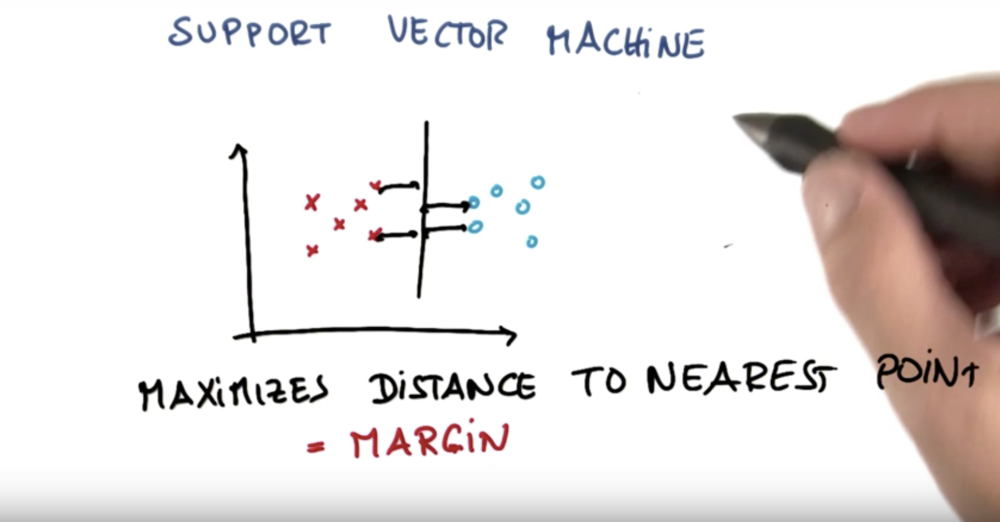
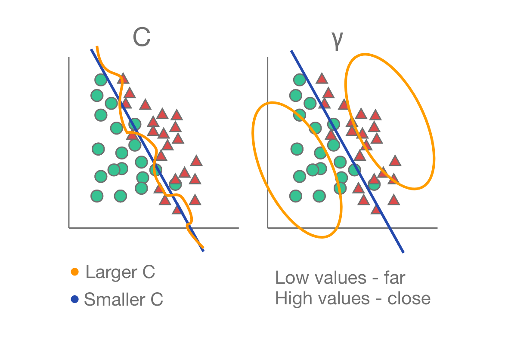
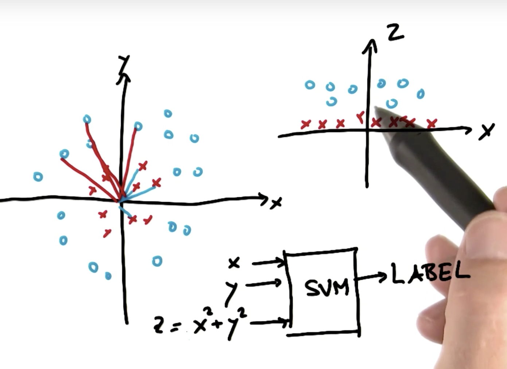
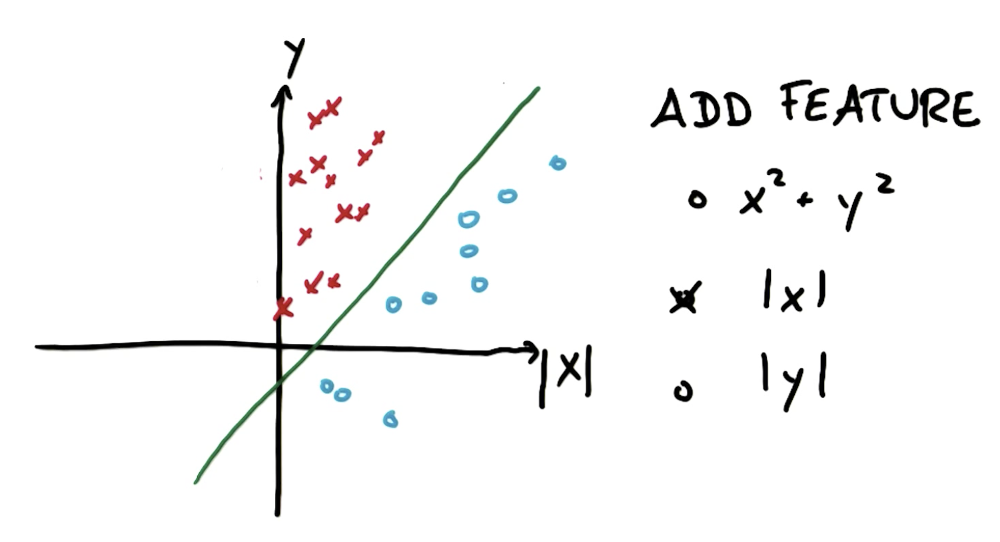

# SVM - Support Vector Machine

## Margin 

**Definition:** _distance from the decision boundry to nearest point._

The main purpose while using SVM is **maximising the margin**. More maximised the margin, more robustness.

## Parameters

### Kernel
In addition to performing linear classification, SVMs can efficiently perform a non-linear classification using what is called the kernel trick, implicitly mapping their inputs into high-dimensional feature spaces. (Wikipedia)

Might be linear or RBF.

### Gamma (γ)
Defines hiw far the influence if a single training example reaches.

### C 
Controls tradeoff between smooth decision boundary and classifying training points correctly.

## Adding feature

## Application purposes
If speed is a major consideration (and for many real-time machine learning applications, it certainly is) then you may want to sacrifice a bit of accuracy if it means you can train/predict faster.

Use if:
* Predicting the author of an email flagging

Don’t use if:
* Flagging credit card fraud and blocking a transaction before it goes through
* Voice recognition, like Siri

## Prons & Cons

### Pros
- They work really well in complicated domains when there is a clear margin of separation.

### Cons
- They don’t perform so well in very large data sets, because the training time happens to be cubic in the size of the data set.
- They also don’t work well with lots of noise. So when the class are very overlapping you have to count independent evidence. (In this case Naive Bayes would work better)

## Conclusion:
If you have a big data set, if you have lots of feature SVM might be very slow.